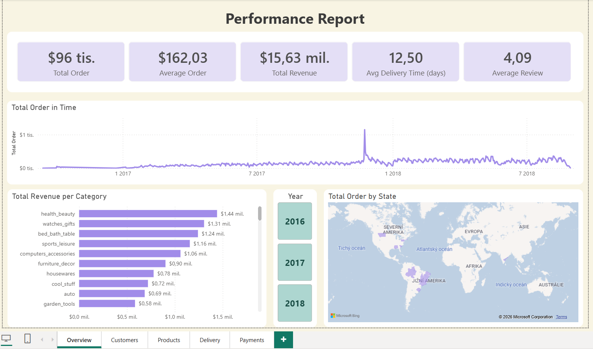
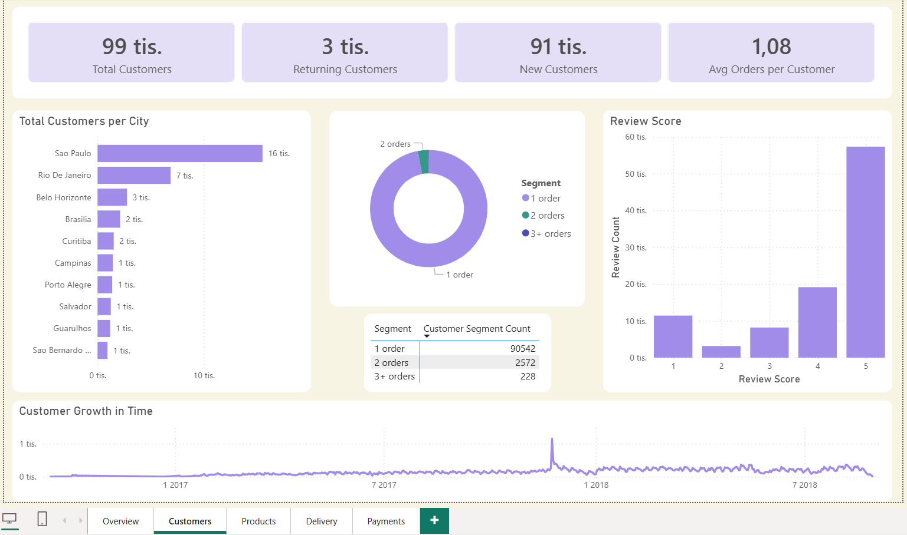
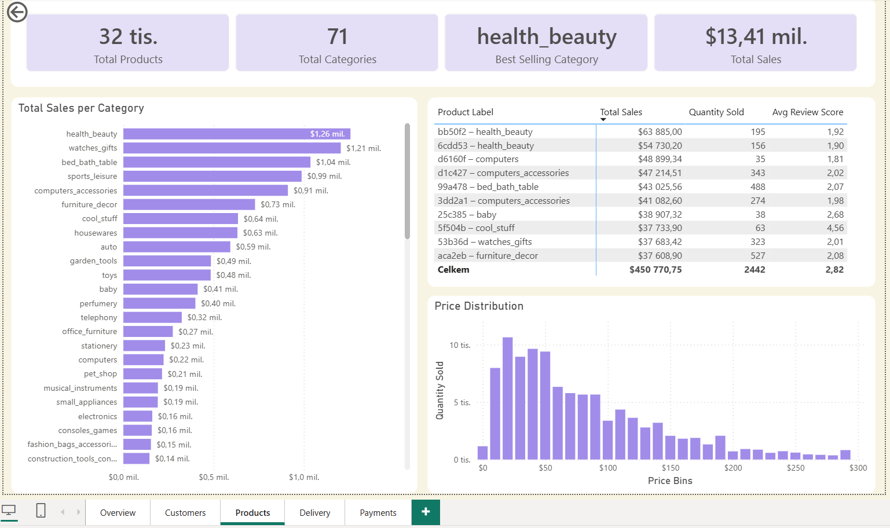
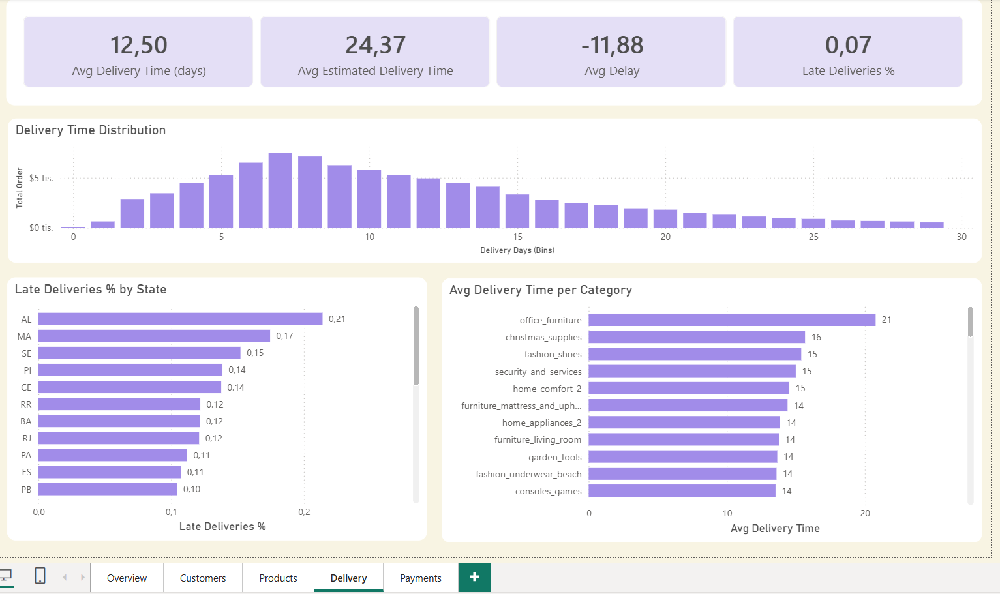
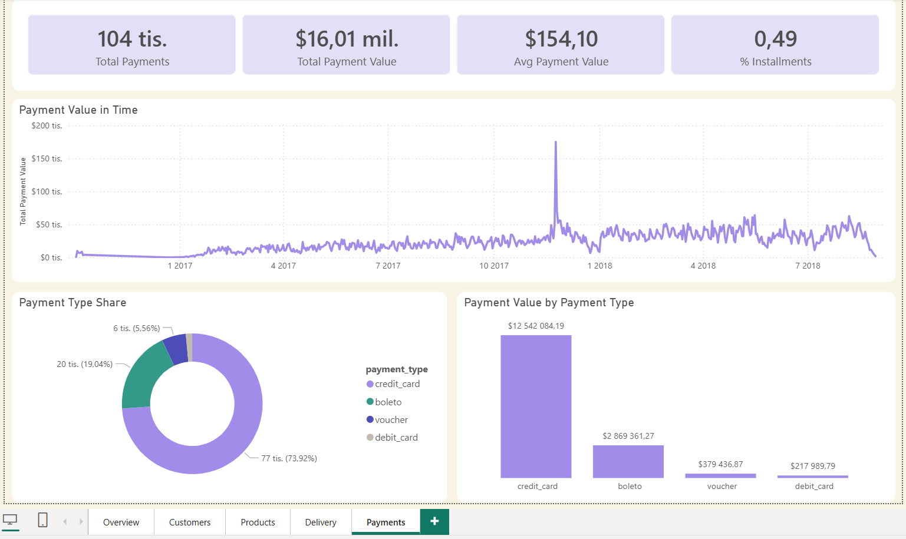
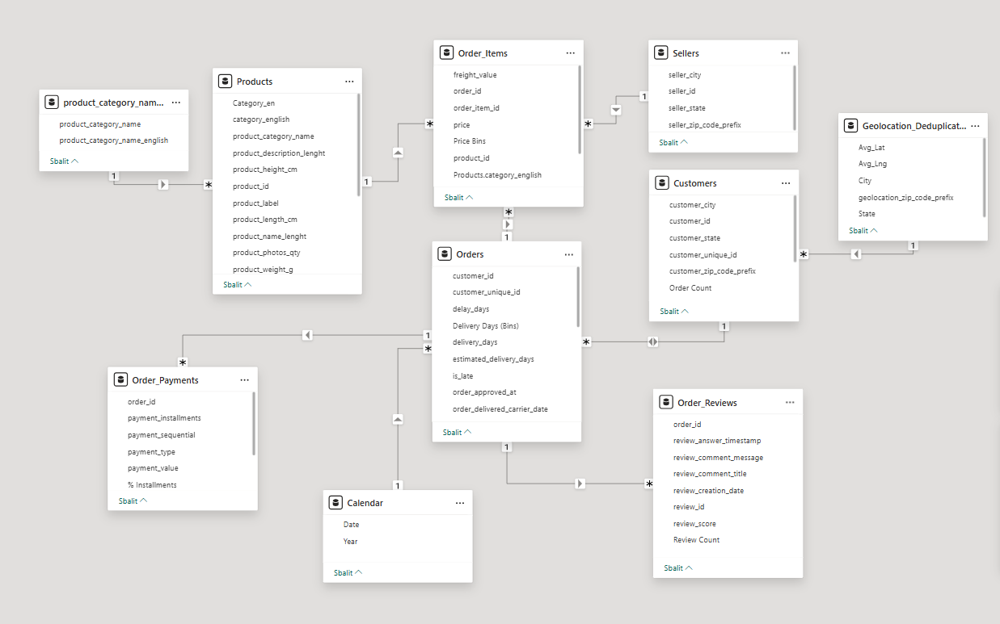

# Power BI Project – E‑Commerce Analysis

This repository contains a Power BI Project (.pbip) analyzing e‑commerce performance using real marketplace data from Brazil.  
The goal of the dashboard is to provide clear, actionable insights into customer behavior, product performance, payment patterns, and delivery efficiency.

---

## Dashboard Overview

The report consists of five main pages:

### **1. Performance Report**
- KPIs: Total Orders, Average Order Value, Total Revenue, Average Delivery Time, Average Review Score  
- Visuals: Orders over time, Revenue per category, Geographic distribution of orders  

### **2. Customers**
- KPIs: Total Customers, Returning vs. New Customers, Average Orders per Customer  
- Visuals: Customer segmentation, Review score distribution, Customer growth over time  

### **3. Products**
- KPIs: Total Products, Total Categories, Best‑Selling Category, Total Sales  
- Visuals: Sales per category, Product‑level performance table, Price distribution histogram  

### **4. Delivery**
- KPIs: Average Delivery Time, Average Estimated Delivery Time, Average Delay, Late Deliveries %  
- Visuals: Delivery time distribution, Late deliveries by state, Average delivery time per category  

### **5. Payments**
- KPIs: Total Payments, Total Payment Value, Average Payment Value, % Installments  
- Visuals: Payment value over time, Payment type share, Payment value by payment type  

---

## Data Model

The semantic model includes relationships between:
- Orders  
- Order Items  
- Payments  
- Customers  
- Products  

All calculations are implemented using DAX, including:
- Time‑intelligence measures  
- Customer growth metrics  
- Payment KPIs  
- Category and product aggregations  

---

## Dashboard Preview + Data Model

---

## How to open the Project

1. Download the `.pbip` file together with the `Report` and `SemanticModel` folders.  
2. Open the `.pbip` file in **Power BI Desktop (2024 or newer)**.  
3. Load the sample dataset or connect your own data source.

---

## Author

Created by **Marie Pojarová**  
